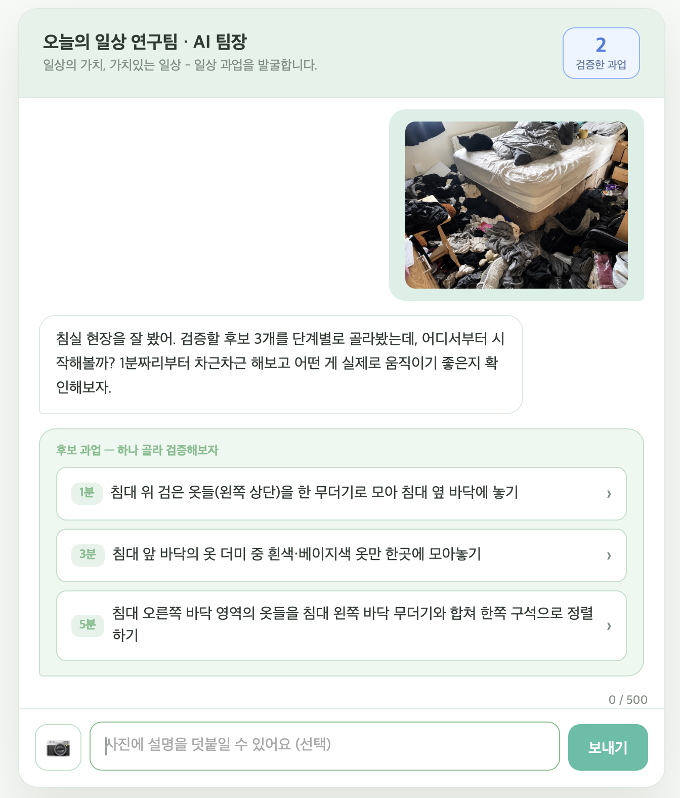

# 일상 연구

## [01] 소개

고립·은둔 청년이 주변 사진 한 장으로 1~5분 생활 과업을 받아, '치료받는 환자'가 아니라 '다른 청년을 돕는 발굴·검증 팀원'으로서 부담 없이 '해냈다'는 감각을 되찾는 일상 회복 서비스.

## [02] 누가 쓰는가

'지금 뭘 해도 늦었다'는 무기력에 '회복받는 대상'이 되기는 싫은 마음까지 겹쳐 아무것도 시작하지 못하는 **고립·은둔 청년**(그리고 이들을 지원하는 지자체).

## [03] 어떻게 쓰는가

- **입력** — 자기 주변에서 발굴할 만한 장면 사진(어지러진 방·설거지·분리수거 등) + 선택 설명
- **처리** — AI 팀장이 사진을 분석해 1·3·5분짜리 초소형 후보 과업 생성 (팀장→상담가 2단계 체인, 위기 신호 시 회복 지원 우선)
- **출력** — 과업 카드 → 수행 후 경험 피드백 → 검증 완료 보상(역량 인정 + 기여 적립 + 자라는 새싹)

## [04] 화면



> `screenshot.png`를 리포지토리에 추가하세요. (배포본 https://aipm-camp7.vercel.app 에서 캡처)

## [05] 실행 방법

1. **키 발급** — [Anthropic Console](https://console.anthropic.com/settings/keys)에서 API 키 발급
2. **`.env`에 키 넣기** — `.env.example`을 복사해 값 채우기
   ```
   ANTHROPIC_API_KEY=sk-ant-...   # 필수
   APP_SECRET=...                 # 선택(봇 마찰 토큰)
   SENTRY_DSN=...                 # 선택(에러 모니터링)
   ```
3. **로컬 실행** — `npm install` 후 `vercel dev` → 안내된 `localhost` 주소 열기
   > `public/index.html`을 그냥 열면 `/api` 함수가 없어 동작하지 않습니다. `vercel dev`가 정적 파일과 서버리스 함수를 함께 띄웁니다.

## [06] 다음 계획

위기 신호 조기 감지·담당자 연계 + 익명 집계 성과 리포트를 담은 **지자체 운영 대시보드** 추가.
